# Senior Project 2018: LUMOS (Android Application)
Janette Lopez Urzua | Rana Shamoun | Imaan Tariq | Su Tun | Le Dao

### Overview
LUMOS is an android application that a person can use to quickly send their location through messages every minute to up to 5 contacts when they are not feeling safe by clicking only one button (turn on the alarm). The application also includes the option of video recording once before stopping the alarm.

### Code Structure
#####

### Need
##### 1. Android Phone (Developer Options must be turned ON)
##### 2. Laptop
##### 3. Android Studio
##### 4. USB cable to connect phone to laptop

### Get Code
##### 1. Go to this link: https://github.com/SuPyaeTun/lumos
##### 2. Make sure branch: master
##### 3. Look for "Clone or Download" (Green Button) and click on it
##### 4. Click on "Download ZIP"
##### 5. Unzip folder 

### Run the Code
##### 1. Go to Android Studio 
##### 2. Click on File > Open...
##### 3. This shows an "Open File or Project" window
##### 4. On that window, look for the unzipped folder. Once you find it, expanded by clicking on the arrow on the left to the folder's name 
##### 5. Click on the project with the same name as the folder, and then click "OK"
##### 6. Connect Android Phone to Laptop using the USB cable
##### 7. Click on Run > Run 'app'
##### 8. This shows a "Select Deployment Target" window
##### 9. On that window, look for your phone's name under the "Connected Devices" section.
##### 10. Click on your phone's name and then click on "OK"
##### 11. This should install and open the LUMOS application on your phone.

### Screenshots
Splash Screen
&nbsp;     
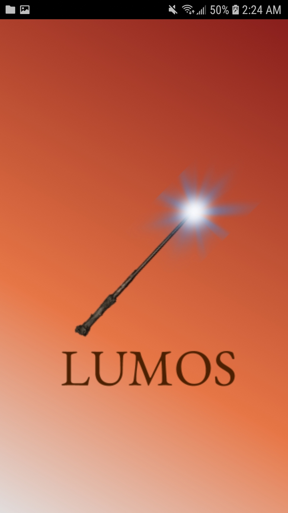

Sign In Screen
&nbsp;     
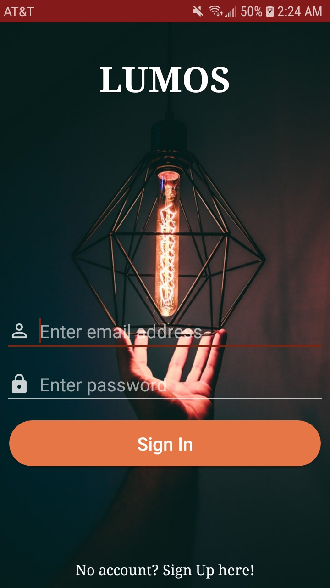
 
Sign Up Screen
&nbsp;     
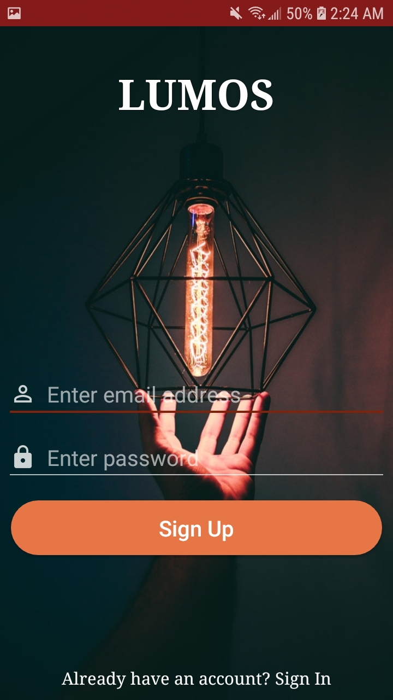

Add Contacts Screen
&nbsp;     
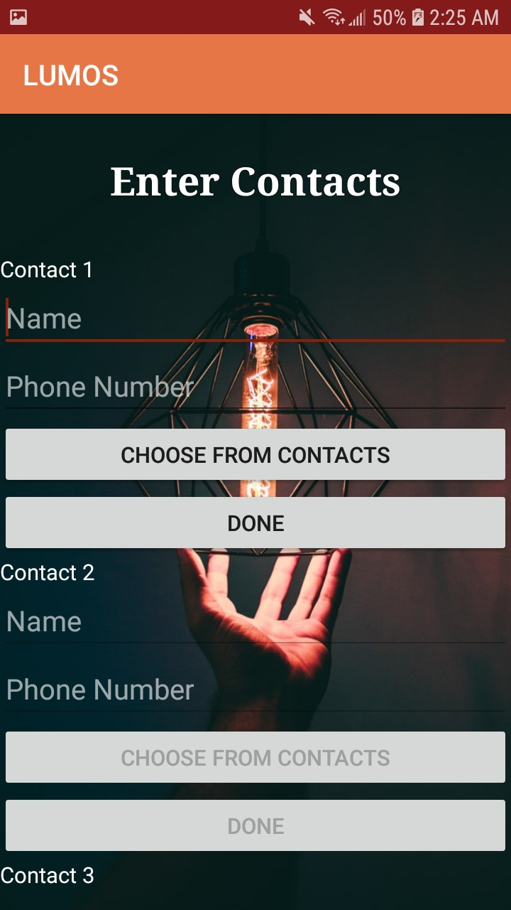

Main Screen (Button not pressed yet)
&nbsp;     
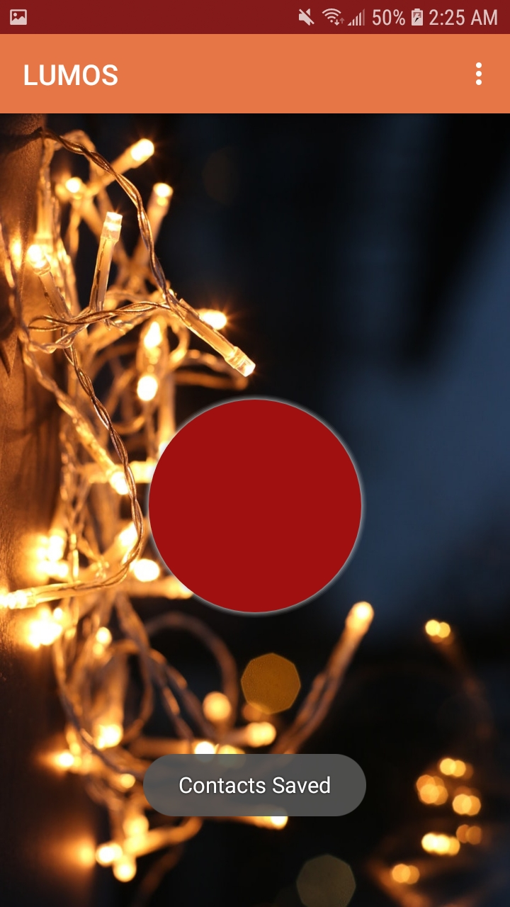

Pop Up Menu
&nbsp;     
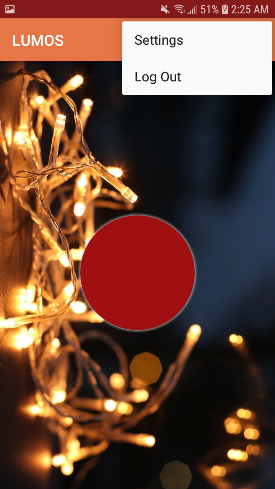

Settings Screen
&nbsp;     
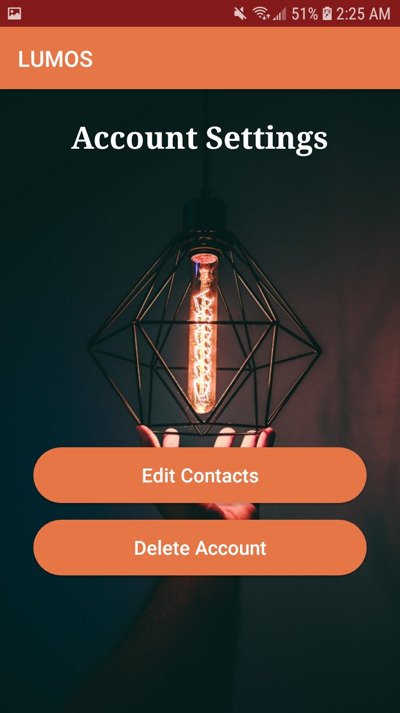

Pop Up Dialog to Delete Account
&nbsp;     
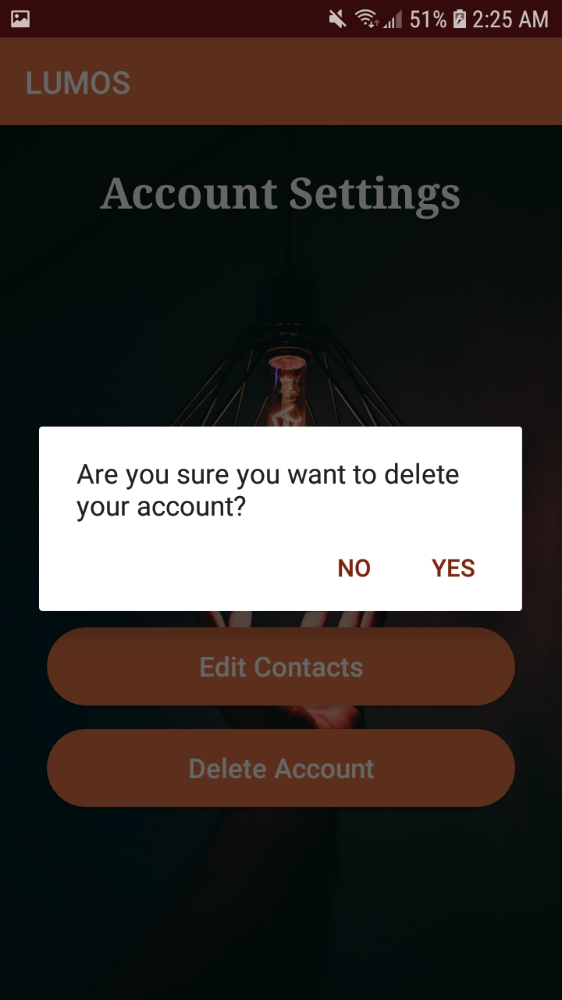

Edit Contacts Screen
&nbsp;     
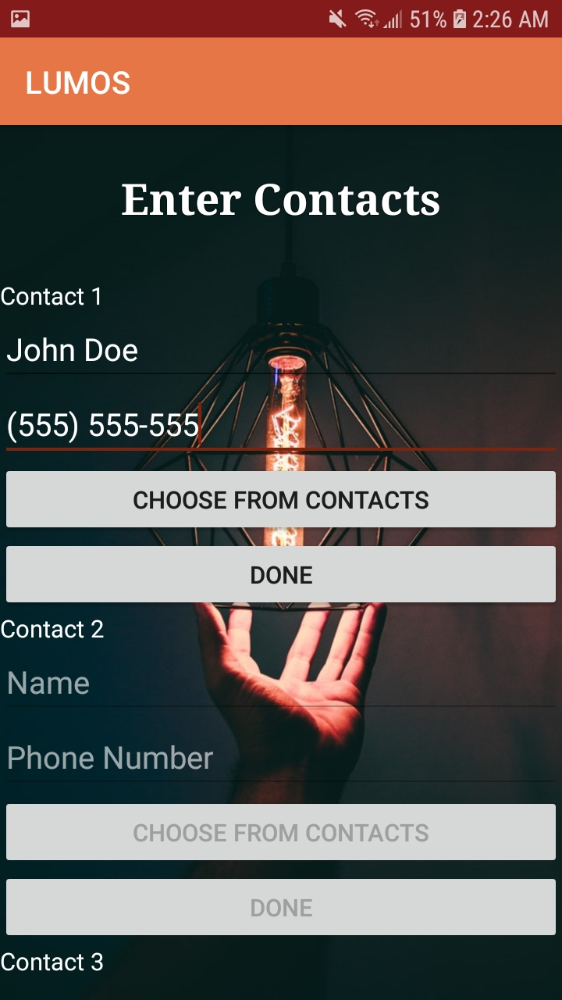

Main Screen (After Button is pressed once - send messages to contacts every minute)
&nbsp;     
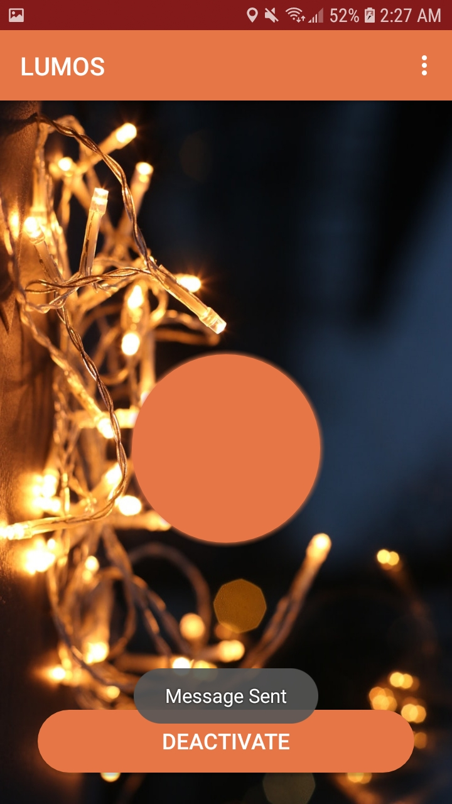

Video Recording Screen (After Button is pressed twice - Enter Recording mode)
&nbsp;     
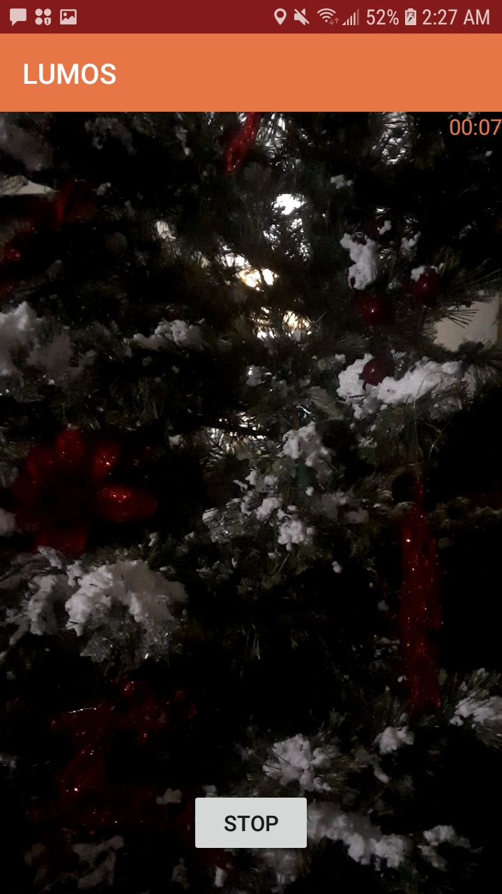

Main Screen (After Video Recording)
&nbsp;     
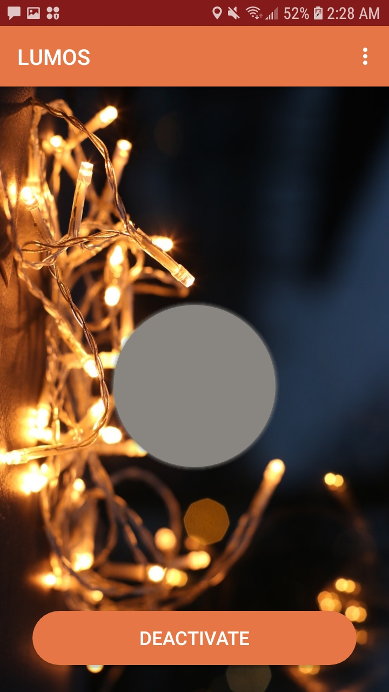

Pop Up Dialog to Deactivate Alarm (stops sending messages every minute)
&nbsp;     
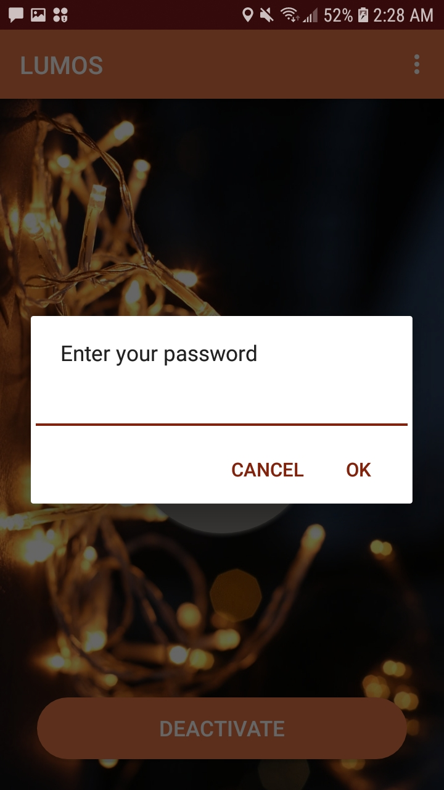

Main Screen (After Alarm is deactivated)
&nbsp;     
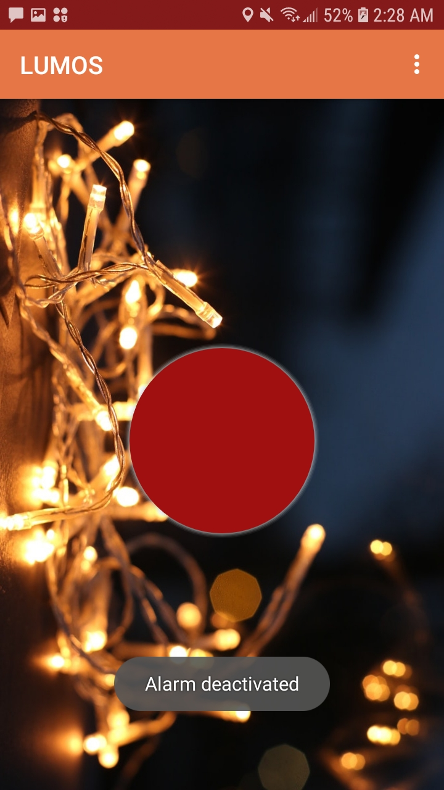
